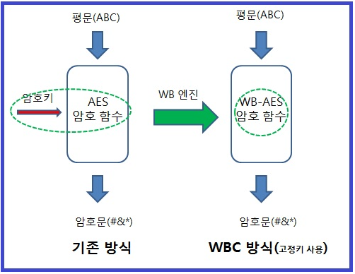

# White Box Cryptography

 

## Table of Contents

- Abstract
- 암호키 탈취 공격의 유형
  - Black-box 공격
  - Gray-box 공격
  - White-box 공격
- White-box 공격을 방지하기 위한 Solution
  - Software Solution : White Box Cryptography

 

 

## Abstract

현대의 암호기술은 컴퓨터를 사용하여 “암호 알고리즘”과 “암호키”로 구현되어지고 있다.

즉, 현대의 암호는 “암호 알고리즘”과 “암호키” 라는  2가지 기본 요소로  구성되어진다. 

암호 알고리즘은 표준화된 암호 알고리즘을 사용하고 있으므로, 결국 암호(Cryptography)의 핵심은 암호키(비밀키 또는 개인키)에 있음을 알 수 있다.

참고로 비밀키(Secrete-Key)는 대칭키 알고리즘에서 사용하는 암호키이며, 개인키(Private-Key)는 비대칭키 알고리즘에서 보호해야 하는 암호키이다.

 

암호 분야에 대한 연구는, 암호 알고리즘 자체에 대한 연구 뿐만 아니라, 암호키를 안전하게 보호하려는 기술과 암호키를 탈취하려는 공격기법이 함께 연구되어져 왔다.

 

암호키를 안전하게 보호하기 위한 기술로 2가지 방법이 제시되어 있다. 

Hardware Solution인 HSM(Hardware Security Module)을 사용하는 방식과 Software Solution인 White Box Cryptography(화이트박스 암호) 기술을 사용하는 것이다. 

HSM 사용 방식은 산업계에서 수십 년 동안 사용되어지고 있는 검증된 기술이며, WBC(White Box Cryptography)는 최근에 주목 받고 있는 기술이다.

 

 

## **암호키 탈취 공격의 유형**

먼저 암호키를 탈취하려는 공격 기법을 보면, 아래 3가지 기법으로 구분할 수 있다.

 

### Black-box(블랙박스) 공격

암호문과 평문을 가지고, 비대칭알고리즘인 경우는 공개키(Public-key)를 가지고, 암호키(Secret-key 또는 Private-key)를 유추해 내는 공격이다.

즉, 암호 알고리즘이  동작되는 내부 정보 및 과정을 볼 수 없기 때문에 Black-box란 용어를 사용한다.

보안 강도는 사용되는 “암호 알고리즘”과 “암호키 길이”에 따라 결정되어진다.

이 경우는 높은 성능을 가진 컴퓨터를 사용하여 암호키를 유추해 내기 때문에 절대적인 시간이 필요하다.

물론 힌트가 되는 정보(오랜 시간 관찰하면 pattern을 알 수 있다)를 입수하면, 계산 시간이 단축된다.

이러한 공격에 대비하는 방법은 주기적으로 암호키를 변경하는 것이다.

 

### Gray-box(그레이박스) 공격

암호 연산 시 발생되는 부가적인(Side) 정보 즉 소요 시간, 전력 사용 패튼, 발생되는 전자기파 정보 등을 입수하여 암호키를 유추하는 공격이다.

이러한 공격을 Side Channel(부채널) 공격이라고도 부른다.

이러한 공격을 방지하기 위해서, 물리적으로 부가적인 정보가 유출되지 않도록 방지하는 기법과, 부가적인 정보가 유출되더라도 암호 알고리즘 상에서 암호키를 유추하지 못하도록 구현하는 기법을 사용한다.

암호 알고리즘 상에서 Side Channel 공격을 방지하는 기능을 구현한 알고리즘을 “Side Channel 내성 암호 알고리즘”이라고 부른다.

메모리를 얼려서 암호키를 알아내는 공격인, Cold Boot Attack 도 Side Channel 공격의 한 종류로 분류하고 있다. 

Gray-box란 Black-box 와White-box 의 중간 단계에 속한다는 의미이다.

 

### White-box(화이트박스) 공격

White-box란 용어가 내포하듯이 암호 연산 과정을 들여다 보면서 공격을 한다는 의미이다.

emulator 등의 software 분석 tool을 사용하여, 메모리 정보나 동작 과정 정보 등을 알아내어 암호키를 찾아낸다. 

예를 들면, 암호키를 사용하는 특정 Application 이나 시스템을 입수하여, 자신의 분석 환경에서 디버깅 기법이나 리버스 엔지니어링(Reverse Engineering) 기법으로 암호 연산 과정을 추적하여 엄호키를 찾아내는 방식이다. 

White-box 공격 과  Total-access 공격은 같은 의미가 된다.

 

Black-box 공격의 어려움(난이도)를 알기 때문에, 암호키 탈취를 목표로 하는 공격자는, Gray-box 공격이나 White-box 공격을 시도한다.

White-box 공격을 하기 위해서는, 백도어 기능을 가진 악성코드(Malware)를 사용자 시스템에 몰래 설치하여 실행시키거나, 암호키 정보를 가지고 있는 디바이스를 훔치는 것 등의 방법을 사용한다.

 

 

## **White-box** 공격을 방지하기 위한 Solution

White-box 공격을 방지하기 위한 대응 Solution으로 나온 것이 **HSM** 과 **WBC(White Box Cryptography)** 이다.

단순하게 정리하면 HSM은 Hardware Solution이고, WBC는 Software Solution 이다.

Application을 개발하는 입장에서 보면, 동작되는 시스템에서 HSM기능(TPM module 이나TEE 지원 등) 지원 여부에  따라, 암호키 보관 기능을 구현해야 한다.

HSM 기능이 없다면, password방식의 암호기능이나 난독화 기능을 사용하여, 암호키가 평문으로 노출되는 것을 방지해야 한다.

WBC(White Box Cryptography)는 Software 방식, 즉 암호키가 노출되지 않고 암호 함수 속에 들어가 동작되기 때문에, Application 개발자에겐, Hardware Independent 한 매력적인 Solution으로 여겨지고 있다.

 

### **Software Solution : White Box Cryptography**

White Box Cryptography(화이트박스 암호)는 암호알고리즘이 동작되는 platform이 open-platform이라는 가정하에, 즉 누구나 접근할 수 있는 환경하에서, 암호기능(암호화 및 복호화)를 수행할 수 있도록 개발된 암호기술이다. 

사용자 관점에서 본 open-platform이란, 공격자 입장에서 보면 White Box 공격을 할 수 있는 환경이다.

  

WBC(White Box Cryptography)가 구현이 되어 있으면, 사용자가 암호기능이 수행되는 디바이스를 분실했더라도, 또는 해커가 몰래 침투해 있더라도, 암호키가 유출되지 않는다는 것이다.

또한 HSM 사용시, 비용의 증가 및 구현(디바이스 내부에 HSM기능 구현)의 난이도가 있는 반면, WBC는 Software만으로 쉽게 구현되며, patch 또는 Upgrade도 쉽게 되는 장점이 있다.

  

요약하면, WBC는 White-box 공격이 있는 상황에서도 암호 정보(암호키 및 Salt 정보)를 안전하게 지키는 목적으로 개발된 암호 기술이다.

암호키가 외부 입력 값으로 들어가지 않고 암호 함수 속에 섞여 있다. 이러한 상태를 obfuscation이라고 부른다.

  

WBC는 기존 표준화된 암호 알고리즘과 경쟁 상태에 있는 기술이 아니라, 표준화된 암호 알고리즘을 사용하면서 암호키가 노출되지 않도록 보완하는 기법이다.

즉 ,사용되는 암호키를 software적으로 보다 안전하게 보호하기 위하여 개발된 암호 기술이다.

 

WBC에 대한 기본적인 개념을 먼저 설명하면, 암호 함수 code 와 암호키를 무작위로 섞어서, 혼잡된(obfuscated) 새로운 code를 generate(생성)하여 사용하는 기법이다.

제안되었을 당시는 Table들을 사용하여 mapping하는 방식을 사용하였으나, 그 후 table 없이 code만으로 동일한 보안 강도를 구현하는 방식도 개발되었다.

새롭게 생성된 code는 동일한 암복호화 기능을 수행하게 된다.

즉 암호키가 노출되지 않는 상태로 암복호화 기능이 수행된다.

생성된 새로운 code는 "WB 암호 함수 code" 라고 부른다. 아래 그림은 기본적 개념을 표시한 것입니다.

    
	
Original AES vs. White-box AES (KOR)

    
	
Original AES vs. White-box AES

 

WBC가 개선해야 할 숙제는 Size를 줄이고, 속도를 높이는 것이라고 한다.

그리고 White-box 환경에서 더 높은 보안 강도를 제공하는 비표준 암호 알고리즘도 새롭게 개발되고 있다고 하므로, 이에 대한 연구도 이루어져야 한다.

이러한 암호 알고리즘을 “white-box friendly cipher” 라고 부른다.